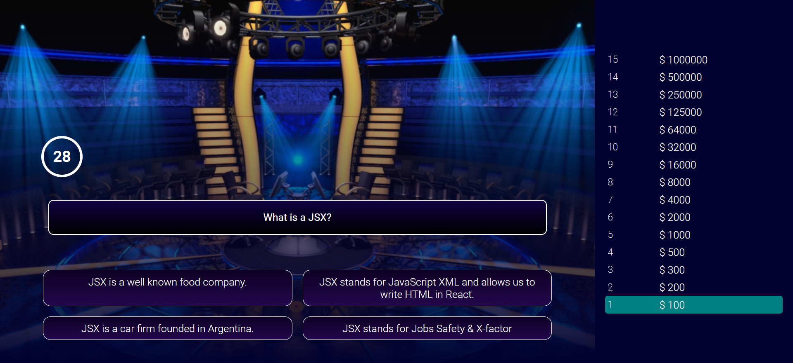

# React Millionaire 
## Built to test your React Knowledge

## Deployed Site 
https://react-millionaire-quiz.herokuapp.com/

## Description 
React Millionaire is an interactive web application built using React. 
React Millionaire is an application which tests users on their knowledge of React.  I was inspired to make this app from the actual game "Who Wants To Be A Millionaire".   The game is simple. The user will receive money after each question they answer. If you answer all the questions correctly you win $1,000,000. User will select an answer and wait three seconds before getting their result. Green indicates correct while red indicates incorrect.   If the user answers incorrectly, the game will end and the amount the user earned will be displayed.   Have fun!    
  

## Table of Contents
* [Installation](#installation)
* [Usage](#usage)
* [Technologies](#technologies)
* [License](#license)
* [Questions](#questions)
* [Website](#website)
* [Contribution](#contribution)

## Installation
In order to install this project, you must login to GitHub and go to https://github.com/mibrahim234/React-Quiz-App. Once there you will click on the green button that says clone or download. You will be given choices on how to download: using the ssh/html key or downloading the zip file.

Using SSH/HTML Key: You will copy the link shown and open up either terminal (mac: pre-installed) or gitbash (pc: must be installed). Once the application is open, you will type git clone paste url here. Once you have cloned the git team-generator repo, cd into the repo and type "open . for mac" Or "code . for windows" to open the folder which contains all files used for the website.

Using Download ZIP: Click on Download Zip. Locate the file and double click it to unzip the file. Locate the unzipped folder and and open it. All the files for the website will be within this folder. 

---

## Usage 

- To use the application locally, enter npm start in the root of the repo to initialize the app.  
Once the app has been initialized, react will open it up in the browser.

---

## Technologies
- [React](https://reactjs.org/)
- [Express](https://expressjs.com/)
- [Heroku](https://heroku.com/)

## License
Copyright (c) [2022]
The license is MIT License. 
Read more about it at https://opensource.org/licenses/MIT.

## Questions
- Please reach out through github or by email. 

- [mibrahim234](https://github.com/mibrahim234) 

- mohamm1417@gmail.com

## Website
[Link to the GIT repository](https://github.com/mibrahim234/React-Quiz-App)

## Contribution
Made with ❤️ by Mohammad Ibrahim 